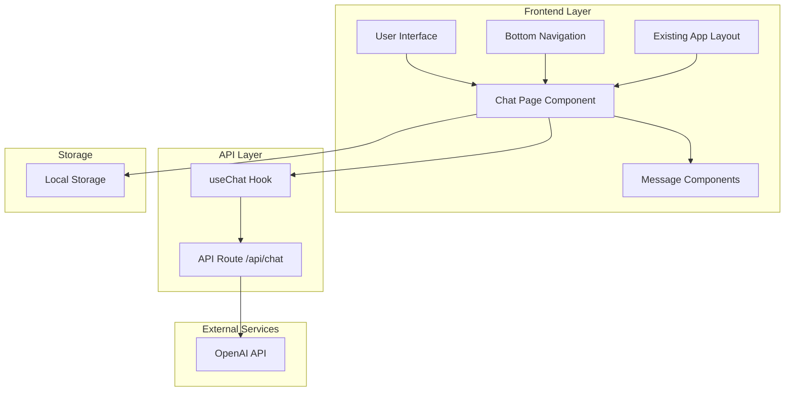

# Design Document: AI Chat Feature

## Overview

This document outlines the design for integrating an AI-powered chat and Q&A feature into the existing Next.js points/rewards application. The feature will leverage the Vercel AI SDK for seamless streaming responses and maintain consistency with the current application's design patterns and architecture.

The AI chat feature will be implemented as a new page accessible through the bottom navigation, providing users with an intelligent assistant for questions, support, and general conversation within the familiar application interface.

## Architecture

### High-Level Architecture



### Component Architecture

The AI chat feature will integrate seamlessly with the existing application structure:

1. **Navigation Integration**: Add chat option to the existing `BottomNav.tsx` component
2. **Page Structure**: Create `/app/ai-chat/page.tsx` following the existing page patterns
3. **API Integration**: Implement `/app/api/chat/route.ts` for AI service communication
4. **State Management**: Use Vercel AI SDK's `useChat` hook for conversation state
5. **Persistence**: Leverage browser localStorage for conversation history

## Components and Interfaces

### Core Components

#### 1. Chat Page Component (`/app/ai-chat/page.tsx`)
```typescript
interface ChatPageProps {}

interface ChatMessage {
  id: string;
  role: 'user' | 'assistant';
  content: string;
  timestamp: Date;
}

interface ChatState {
  messages: ChatMessage[];
  input: string;
  isLoading: boolean;
  error: string | null;
}
```

#### 2. Message Component (`/app/ai-chat/components/Message.tsx`)
```typescript
interface MessageProps {
  message: ChatMessage;
  isStreaming?: boolean;
}
```

#### 3. Chat Input Component (`/app/ai-chat/components/ChatInput.tsx`)
```typescript
interface ChatInputProps {
  input: string;
  isLoading: boolean;
  onInputChange: (value: string) => void;
  onSubmit: (e: FormEvent) => void;
}
```

#### 4. Updated Bottom Navigation
```typescript
// Addition to existing BottomNav.tsx
const navItems = [
  // ... existing items
  {
    name: 'AI Chat',
    path: '/ai-chat',
    icon: <ChatIcon />,
  },
];
```

### API Interfaces

#### Chat API Route (`/app/api/chat/route.ts`)
```typescript
interface ChatRequest {
  messages: Array<{
    role: 'user' | 'assistant';
    content: string;
  }>;
}

interface ChatResponse {
  // Streaming response handled by Vercel AI SDK
}
```

### External Service Integration

#### OpenAI Configuration
```typescript
interface OpenAIConfig {
  apiKey: string;
  model: 'gpt-3.5-turbo' | 'gpt-4';
  temperature: number;
  maxTokens: number;
}
```

## Data Models

### Message Model
```typescript
interface Message {
  id: string;
  role: 'user' | 'assistant';
  content: string;
  timestamp: Date;
  metadata?: {
    tokens?: number;
    model?: string;
    error?: string;
  };
}
```

### Conversation Model
```typescript
interface Conversation {
  id: string;
  messages: Message[];
  createdAt: Date;
  updatedAt: Date;
  title?: string;
}
```

### Chat Configuration
```typescript
interface ChatConfig {
  maxMessages: number;
  retryAttempts: number;
  streamingEnabled: boolean;
  persistHistory: boolean;
}
```

### Local Storage Schema
```typescript
interface ChatStorage {
  conversations: Conversation[];
  currentConversationId: string | null;
  settings: {
    theme: 'light' | 'dark';
    fontSize: 'small' | 'medium' | 'large';
  };
}
```

## Correctness Properties

*A property is a characteristic or behavior that should hold true across all valid executions of a system—essentially, a formal statement about what the system should do. Properties serve as the bridge between human-readable specifications and machine-verifiable correctness guarantees.*

Before defining the correctness properties, I need to analyze the acceptance criteria from the requirements to determine which ones are testable as properties.

### Property Reflection

After reviewing the prework analysis, I identified several areas where properties can be consolidated to eliminate redundancy:

1. **Message validation properties (2.3, 2.4)** can be combined into a single comprehensive input validation property
2. **Message display properties (2.5, 3.3, 3.5)** can be consolidated into a comprehensive message display property  
3. **Error handling properties (5.1, 5.2, 5.3, 5.4, 5.5)** can be streamlined to focus on core error handling behaviors
4. **State persistence properties (1.5, 4.2, 4.4)** can be combined into a comprehensive persistence property

### Correctness Properties

Based on the prework analysis, the following properties will be implemented as property-based tests:

**Property 1: Input validation and state management**
*For any* user input string, if the input consists entirely of whitespace characters, then submitting the input should reject the message and leave the conversation state unchanged
**Validates: Requirements 2.3, 2.4**

**Property 2: Message ordering and persistence**
*For any* sequence of messages sent in chronological order, the conversation history should maintain that exact order and persist across page navigation
**Validates: Requirements 4.1, 4.2, 1.5**

**Property 3: Real-time input reflection**
*For any* text typed into the input field, the displayed input value should immediately reflect the typed content
**Validates: Requirements 2.1**

**Property 4: Message processing and display**
*For any* valid user message, sending the message should clear the input field, display the user message in the conversation, and trigger AI response generation
**Validates: Requirements 2.2, 2.5, 3.1**

**Property 5: AI response handling**
*For any* AI response received, the response should be displayed in the conversation with clear visual distinction from user messages
**Validates: Requirements 3.3, 3.5**

**Property 6: Error recovery and retry**
*For any* failed message send operation, the system should preserve the original user input and provide retry functionality
**Validates: Requirements 5.3, 5.4**

**Property 7: Conversation persistence**
*For any* conversation data, the system should store it locally and restore it when the user returns to the chat page
**Validates: Requirements 4.4, 4.2**

**Property 8: Authentication state consistency**
*For any* authentication state in the application, the chat system should respect and maintain the same authentication context
**Validates: Requirements 7.4**

**Property 9: Rapid message handling**
*For any* sequence of rapidly sent messages, the system should process and display all messages without data loss or corruption
**Validates: Requirements 8.4**

**Property 10: Text wrapping behavior**
*For any* message content that exceeds the display width, the text should wrap appropriately without horizontal overflow
**Validates: Requirements 6.5**

## Error Handling

### Error Categories and Responses

#### 1. Network Connectivity Errors
- **Detection**: Monitor network status and API request failures
- **Response**: Display offline indicator and queue messages for retry
- **Recovery**: Automatic retry when connectivity is restored

#### 2. AI Service Errors
- **Detection**: API response errors, timeouts, rate limiting
- **Response**: User-friendly error messages with retry options
- **Recovery**: Exponential backoff retry strategy

#### 3. Input Validation Errors
- **Detection**: Client-side validation of message content
- **Response**: Prevent submission and maintain input state
- **Recovery**: Allow user to modify input and retry

#### 4. Storage Errors
- **Detection**: localStorage quota exceeded or unavailable
- **Response**: Graceful degradation to session-only storage
- **Recovery**: Notify user of storage limitations

### Error Handling Implementation

```typescript
interface ErrorState {
  type: 'network' | 'service' | 'validation' | 'storage';
  message: string;
  retryable: boolean;
  retryCount: number;
}

interface ErrorHandling {
  maxRetries: number;
  retryDelay: number;
  exponentialBackoff: boolean;
  fallbackBehavior: 'queue' | 'discard' | 'notify';
}
```

## Testing Strategy

### Dual Testing Approach

The AI chat feature will employ both unit testing and property-based testing to ensure comprehensive coverage:

**Unit Tests**: Focus on specific examples, edge cases, and integration points
- Component rendering with specific props
- API route responses with known inputs
- Error boundary behavior with specific error conditions
- Navigation integration with existing components

**Property Tests**: Verify universal properties across all inputs
- Input validation with generated text strings
- Message ordering with random message sequences
- State persistence with various conversation scenarios
- Error handling with simulated failure conditions

### Property-Based Testing Configuration

- **Framework**: Use `fast-check` library for TypeScript property-based testing
- **Iterations**: Minimum 100 iterations per property test
- **Test Tagging**: Each property test must reference its design document property
- **Tag Format**: `Feature: ai-chat, Property {number}: {property_text}`

### Testing Implementation Requirements

Each correctness property must be implemented as a single property-based test that:
1. Generates appropriate random inputs for the property domain
2. Executes the system behavior being tested
3. Verifies the expected property holds true
4. References the specific design property and requirements

### Integration Testing

- **API Integration**: Test complete request/response cycles with OpenAI API
- **Component Integration**: Test interaction between chat components and existing navigation
- **State Management**: Test conversation persistence across component lifecycle
- **Error Scenarios**: Test system behavior under various failure conditions

### Performance Testing Considerations

While performance properties are not included in property-based tests due to environment dependencies, the following should be monitored:
- Initial page load time
- Message send/receive latency  
- Memory usage with large conversation histories
- Scroll performance with many messages

The testing strategy ensures both correctness through property verification and reliability through comprehensive unit test coverage.